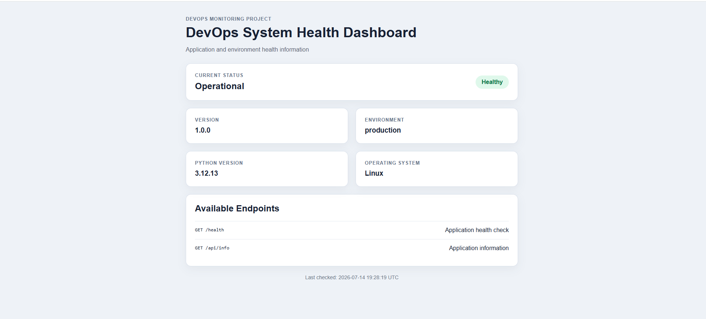
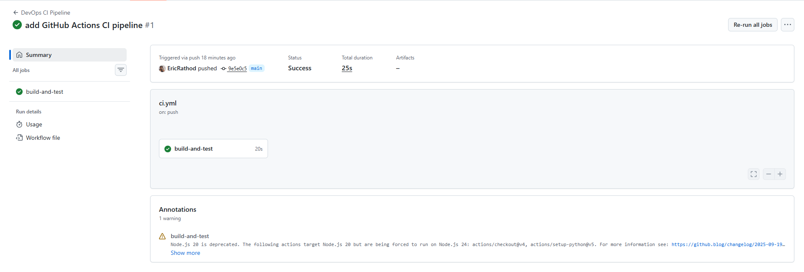
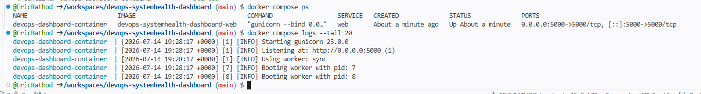

# 🚀 DevOps System Health Dashboard


A Dockerized Flask application demonstrating modern DevOps practices including Docker, Docker Compose, GitHub Actions CI, automated testing with Pytest, environment-based configuration, and Gunicorn production deployment.

---
## 🌐 Live Demo

🔗 **Live Application:**  
https://devops-systemhealth-dashboard.onrender.com/

> **Note:** This application is hosted on Render's free tier. The first request after a period of inactivity may take 30–60 seconds while the service starts.


## 📖 Overview

The **DevOps System Health Dashboard** is a lightweight monitoring application that provides application health and environment information through a responsive web dashboard and REST APIs.

This project demonstrates fundamental DevOps concepts such as:

- Containerization with Docker
- Multi-service management using Docker Compose
- Continuous Integration using GitHub Actions
- Automated testing with Pytest
- Production deployment using Gunicorn
- Environment-based configuration

---

# ✨ Features

- ✅ Interactive System Health Dashboard
- ✅ REST API Endpoints
- ✅ Health Check Endpoint
- ✅ Application Information API
- ✅ Environment Variable Configuration
- ✅ Docker Containerization
- ✅ Docker Compose
- ✅ GitHub Actions CI Pipeline
- ✅ Automated Testing with Pytest
- ✅ Gunicorn Production Server
- ✅ Responsive Web Interface

---

# 🛠 Tech Stack

| Category | Technology |
|-----------|------------|
| Language | Python 3.12 |
| Framework | Flask |
| Production Server | Gunicorn |
| Containerization | Docker |
| Container Management | Docker Compose |
| CI/CD | GitHub Actions |
| Testing | Pytest |
| Frontend | HTML, CSS |
| Version Control | Git & GitHub |

---

# 📂 Project Structure

```text
devops-systemhealth-dashboard/
│
├── .github/
│   └── workflows/
│       └── ci.yml
│
├── docs/
│   └── screenshots/
│       ├── dashboard.png
│       ├── docker-compose.png
│       └── github-actions.png
│
├── static/
│   └── style.css
│
├── templates/
│   └── index.html
│
├── tests/
│   ├── __init__.py
│   └── test_app.py
│
├── .dockerignore
├── .gitignore
├── app.py
├── compose.yml
├── config.py
├── Dockerfile
├── LICENSE
├── README.md
└── requirements.txt
```

---

# 🏗 Runtime Architecture

```text
               Browser
                   │
                   ▼
             Port 5000
                   │
                   ▼
          Docker Compose
                   │
                   ▼
         Docker Container
                   │
                   ▼
              Gunicorn
                   │
                   ▼
          Flask Application
```

---

# 🔄 CI Pipeline

```text
Developer Push
       │
       ▼
GitHub Repository
       │
       ▼
GitHub Actions
       │
       ▼
Install Dependencies
       │
       ▼
Run Pytest
       │
       ▼
Build Docker Image
```

---

# 🌐 API Endpoints

## Health Check

```
GET /health
```

Example Response

```json
{
    "status": "healthy"
}
```

---

## Application Information

```
GET /api/info
```

Example Response

```json
{
    "application": "DevOps System Health Dashboard",
    "version": "1.0.0",
    "environment": "production",
    "python_version": "3.12.x",
    "operating_system": "Linux"
}
```

---

# 🚀 Running the Project

## Clone Repository

```bash
git clone https://github.com/EricRathod/devops-systemhealth-dashboard.git
cd devops-systemhealth-dashboard
```

---

## Install Dependencies

```bash
pip install -r requirements.txt
```

---

## Run Locally

```bash
python app.py
```

Open:

```
http://localhost:5000
```

---

# 🐳 Docker

## Build Image

```bash
docker build -t devops-dashboard .
```

## Run Container

```bash
docker run -p 5000:5000 devops-dashboard
```

---

# 🐳 Docker Compose

## Build and Start

```bash
docker compose up --build
```

## Start in Background

```bash
docker compose up -d
```

## Stop

```bash
docker compose down
```

---

# 🧪 Running Tests

```bash
pytest -v
```

---

# ⚙ Continuous Integration

The GitHub Actions workflow automatically:

- Checks out the repository
- Installs Python dependencies
- Executes automated tests with Pytest
- Builds the Docker image

The workflow runs automatically whenever code is pushed to the **main** branch.

---

# 📸 Project Screenshots

## Dashboard



---

## GitHub Actions CI Pipeline



---

## Docker Compose



---

# 🚀 Future Improvements

- AWS EC2 Deployment
- Kubernetes Deployment
- Terraform Infrastructure as Code
- Prometheus Monitoring
- Grafana Dashboard
- Nginx Reverse Proxy
- HTTPS with SSL
- Centralized Logging

---

# 📄 License

This project is licensed under the MIT License.

---

# 👨‍💻 Author

**Eric Rathod**

Master of Artificial Intelligence – Design and Development

Seneca Polytechnic

GitHub: https://github.com/EricRathod

LinkedIn: *(Add your LinkedIn profile URL here)*

---

## ⭐ If you found this project useful, please consider giving it a star.
